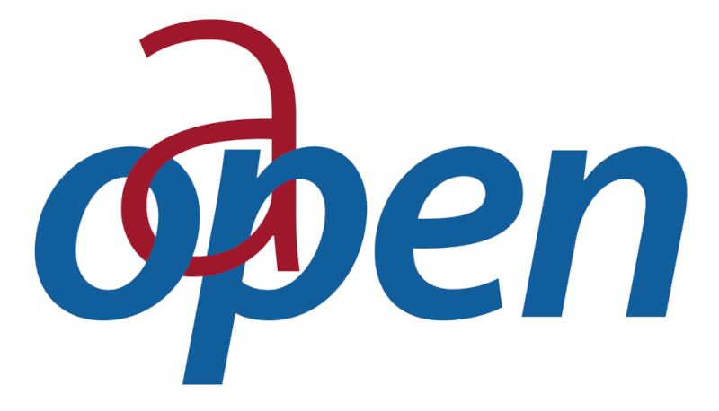

# OAeBU Workflows

OAeBU Workflows provides Apache Airflow workflows for fetching, processing and analysing data about Open Access Books.

## Telescope Workflows
A telescope a type of workflow used to ingest data from different data sources, and to run workflows that process and
output data to other places. Workflows are built on top of Apache Airflow's DAGs.

The workflows include: Directory of Open Access Books (DOAB), Google Analytics, Google Books, JSTOR, Oapen IRUS UK,
Oapen Metadata, Onix, UCL Discovery and an Onix Workflow for combining all of this data.

| Telescope Workflow  | Description |
| ------------- | ------------- |
|  | DOAB is a community-driven discovery service that indexes and provides access to scholarly, peer-reviewed open access books and helps users to find trusted open access book publishers. All DOAB services are free of charge and all data is freely available.  |
|  | Google Analytics is a web-based service that allows groups to track usage of their web properties. It offers vistor counts, statistics, and other breakdowns such as country or origin for visitors. If publishers or partners already have Google Analytics already setup of their website, this usage data is able to be ingested  |
|  | The Google Books Partner program enables selling books through the Google Play store and offering a preview on Google books. As a publisher it is possible to download reports on Google Books data, currently there are 3 report types available (sales summary, sales transaction and traffic) of which we use the latter 2  |the latter 2
|  | JSTOR provides publisher usage reports, the reports offer details about the use of journal or book content by institution, and country. Journal reports also include usage by issue and article.  Usage is aligned with the COUNTER 5 standard of Item Requests (views + downloads) |
|  | IRUS-UK provides OAPEN COUNTER standard access reports. Almost all books on OAPEN are provided as a whole book PDF file. The reports show access figures for each month as well as the location of the access.  Since the location info includes an IP-address, the original data is handled only from within the OAPEN Google Cloud project. |
|  | The OAPEN repository hosts more than 15,000 peer reviewed academic books. OAPEN is working with the Directory of Open Access Books (DOAB), which are used by library catalogues making their books more discoverable. All their metadata feeds are available under a CC0 1.0 license. All of the OA books hosted on OAPEN are registered to DOAB. There are around 1300 titles that are hosted on the OAPEN repository but are not registered to DOAB, as those titles are published under a license that does not allow reuse  |
|  | ONIX is a standard format that book publishers use to share information about the books that they have published. Publishers that have ONIX feeds are given credentials and access to their own upload folder on the Mellon SFTP server. The publisher uploads their ONIX feed to their upload folder on a weekly, fortnightly or monthly basis. The ONIX telescope downloads, transforms (with the ONIX parser Java command line tool) and then loads the ONIX data into BigQuery for further processing |
|  | UCL Discovery is UCL's open access repository, showcasing and providing access to the full texts of UCL research publications.The metadata for all eprints is obtained from their publicly available CSV file (https://discovery.ucl.ac.uk/cgi/search/advanced).  |

## Documentation
For detailed documentation about the OAeBU Workflows see the Read the Docs website [https://oaebu-workflows.readthedocs.io](https://oaebu-workflows.readthedocs.io)
