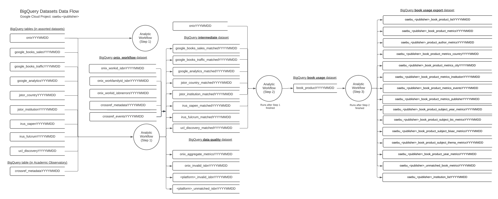

Analytic workflows
_________

Analytic workflows process the data ingested by telescope workflows and are also built on top of Apache Airflow DAGs.

The pilot project has one core workflow, which is broken into three parts and described below. The parts are:
 1. Aggregating and Mapping book products into works and work families
 2. Linking data from metric providers to book products
 3. Creating export tables for visualisation in dashboards

.. toctree::
    :maxdepth: 1

    onix_workflow_intro
    onix_workflow_step_1
    onix_workflow_step_2
    onix_workflow_step_3
